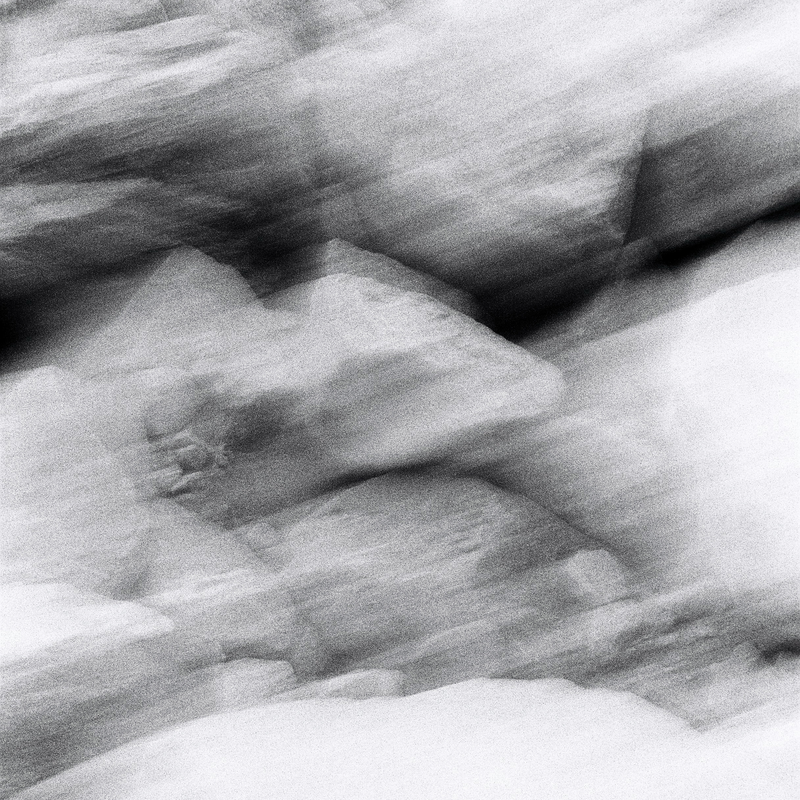
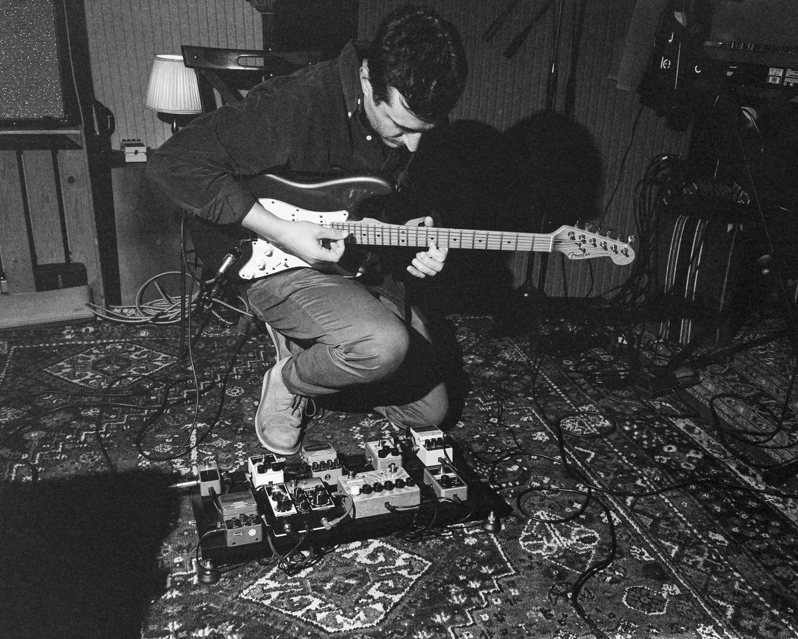
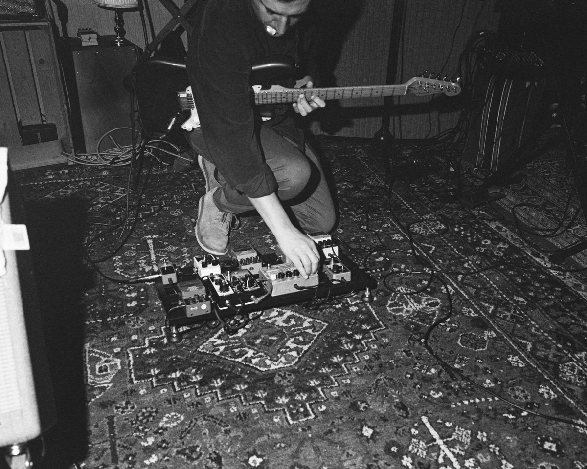
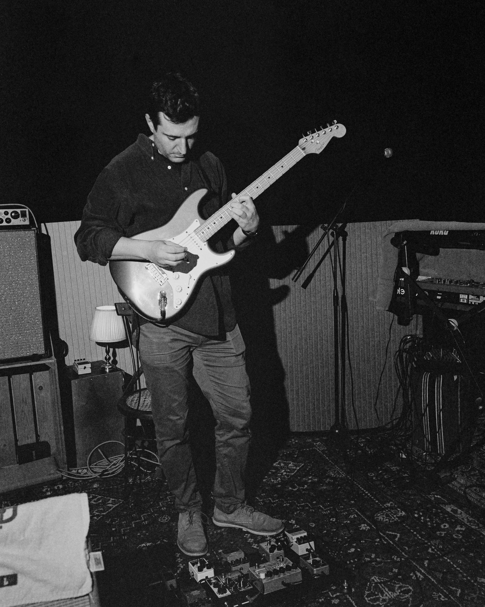
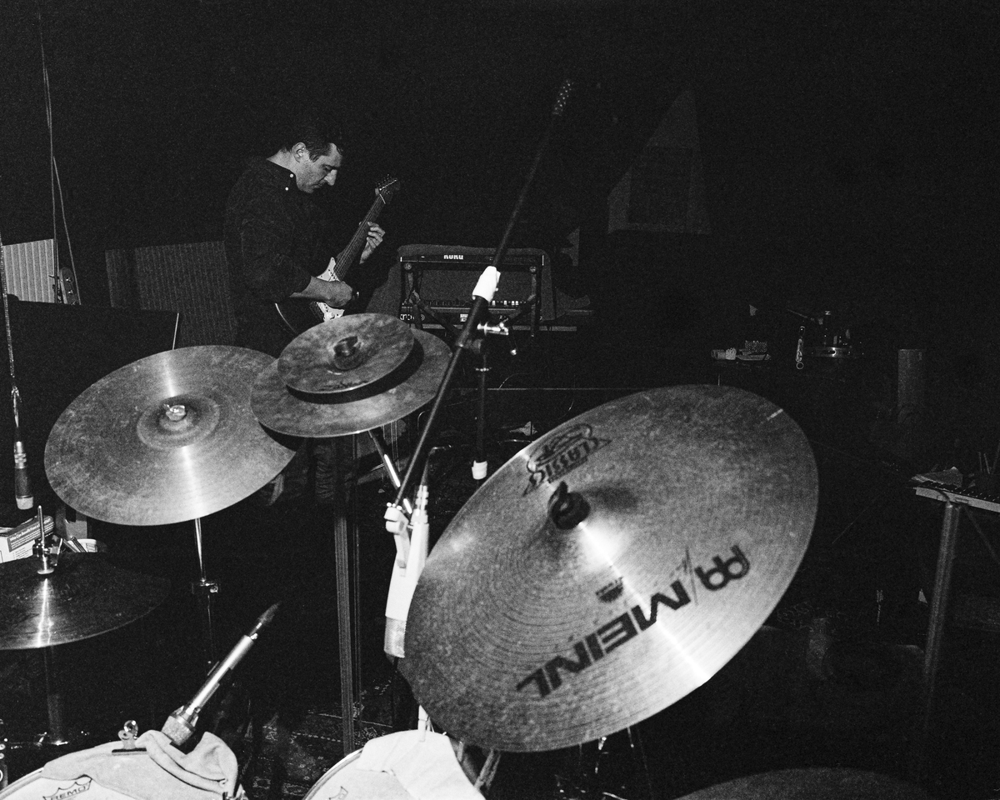
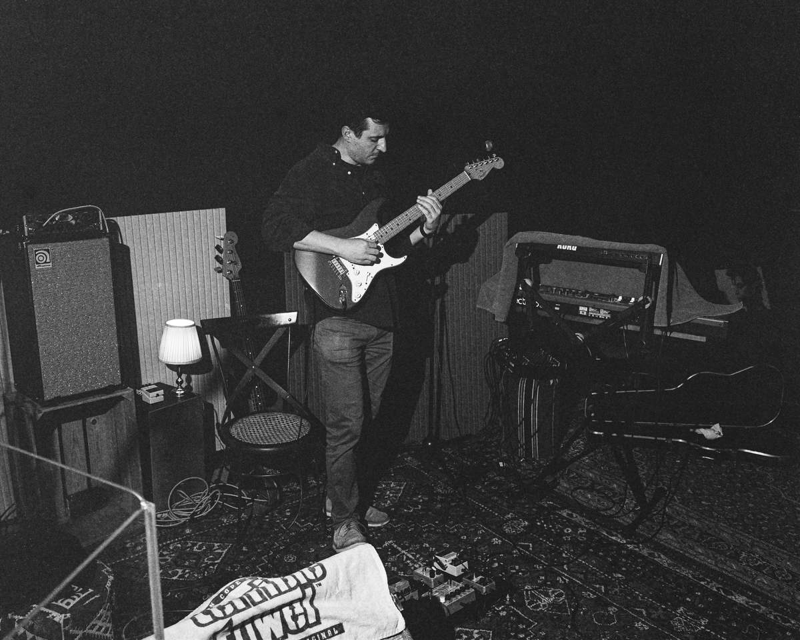
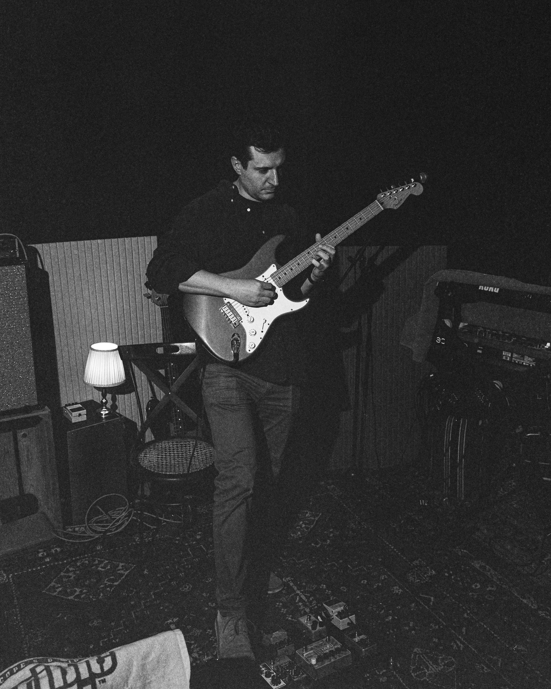

## Bio

RLSM is a Zurich-based solo guitar project blending post-rock tones and distorted textures into an immersive audiovisual experience with original live visuals. The work invites listeners into a space of contemplation, where drifting attention meets moments of emotional intensity and crescendos of awe that briefly draw focus to the performer before dissolving back into introspection.

Through intricate yet melodic guitar layers, silence, and live-projected black-and-white imagery, RLSM explores instinct, ethics, society, and spiritual longing, offering no clear-cut answers but a space to confront doubt, inner drives, and the deeper forces beneath reason. The debut album, set for release in January 2026, is a five-track sonic journey that evokes inner landscapes and raw existence, guiding the audience through reflection, solitude, and emotional resonance.

## Contact Information / Links

- Contacts: [rlsm.zik@gmail.com](mailto:rlsm.zik@gmail.com) / [instagram](https://www.instagram.com/rlsm____)
- Links: [linktr.ee/rlsm](https://linktr.ee/rlsm)

## Videos / Live Performances

  <iframe 
    src="https://www.youtube.com/embed/BGdOJ1PPkBs" 
    frameborder="0" 
    allow="accelerometer; autoplay; clipboard-write; encrypted-media; gyroscope; picture-in-picture" 
    allowfullscreen
    style="position: absolute; top: 0; left: 0; width: 100%; height: 100%;">
  </iframe>

 

  <iframe
    src="https://www.youtube.com/embed/0KdV2sMPJSs"
    frameborder="0"
    allow="accelerometer; autoplay; clipboard-write; encrypted-media; gyroscope; picture-in-picture"
    allowfullscreen
    style="position: absolute; top: 0; left: 0; width: 100%; height: 100%;">
  </iframe>

## Releases

Debut album **"L'abisso è un muro"** ([preview](https://soundcloud.com/rlsm1/sets/labisso-e-un-muro)), set for release on 3 January 2026.

Album cover by [Franziska Martin](https://www.franziskamartin.ch/).

## Press Photos

Press photos by [@stranger](https://www.instagram.com/stranger).

